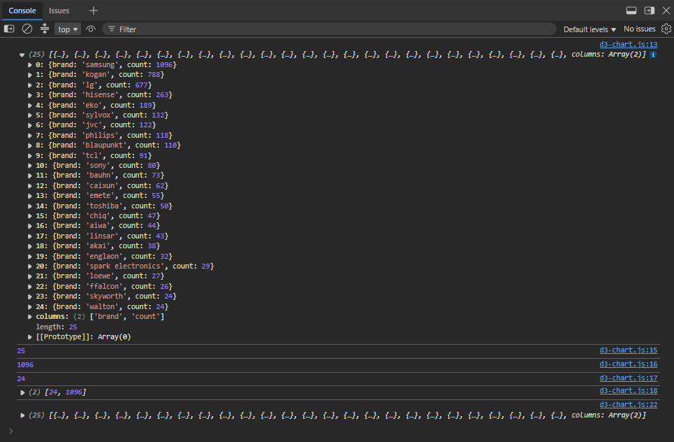

# Exercise 4.4

---

## Exercise Steps

### Step 1: Use Row Conversion Function, `d3.csv()`, to Give D3 Access to Data

Configured asynchronous data loading from the project directory:

- Exported the processed brand count dataset from the KNIME workflow into `tvBrandCount.csv` without quotes and placed it in the `assets/data/` directory
- Connected the file to the web application using D3's asynchronous file reader: `d3.csv("assets/data/tvBrandCount.csv", ...)`

### Step 2: Check Browser Console for Objects Created from Your Dataset

Ensured that imported data values are converted to proper JavaScript types:

- Identified that default CSV imports treat all columns (including numerical counts) as text strings
- Applied an accessor row conversion function using dot notation and the unary plus operator (`+d.count`) to cast the count attribute to a primitive number
- Verified in the browser developer console that each object contains a string for `brand` and a numeric value for `count`

### Step 3: Finding Information About the Dataset & Preparing for Visualisation

Extracted summary metrics, ordered the data, and passed it to the chart-rendering function:

- Logged the initial typed data array to the console to confirm successful ingestion
- Queried dataset dimensions and bounds using D3 array utilities:
  - `console.log(data.length)` to log the total number of brands
  - `console.log(d3.max(data, d => d.count))` to find the maximum count
  - `console.log(d3.min(data, d => d.count))` to find the minimum count
  - `console.log(d3.extent(data, d => d.count))` to return an array containing `[min, max]`
- Applied JavaScript's `.sort()` method (`(a, b) => b.count - a.count`) to sort brand frequencies in descending order
- Logged the sorted array to verify that the highest-count brands appear first
- Executed `drawBarChart(data)` within the `.then()` promise block to hand off the sorted array to the rendering function, accompanied by a `.catch()` block to catch file-loading errors
- Declared a placeholder `drawBarChart(data)` function to prevent runtime reference errors until the bar chart is constructed in Exercise 4.5

---

## AI Declaration

Artificial Intelligence (AI) tools were used to assist with generating documentation following the unit's standardised README structure.